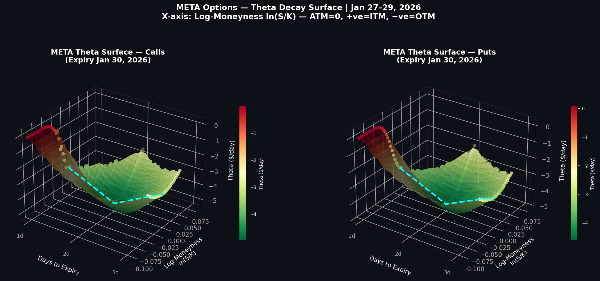
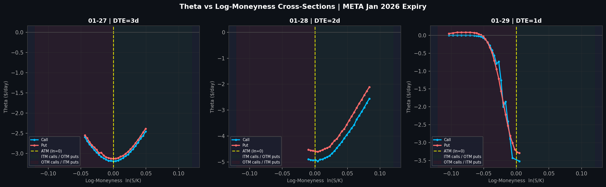

# META Options — Theta Decay Surface Model

A quantitative options analysis project modelling **Black-Scholes theta decay** across three distinct volatility regimes in META's Q4 2025 earnings cycle — the final 3 days before a weekly expiry (Jan 27–29, 2026, expiry Jan 30).

## Overview

The core goal of this project was to **understand, model, and predict theta behavior during an earnings volatility regime** — how does time decay behave structurally when IV spikes into an event and then collapses after? META's Q4 2025 earnings created a textbook 3-regime environment within a single expiry cycle.

The project builds a **3D theta surface** using real market data (bid/ask/IVM) and identifies three structurally distinct regimes, each with different theta dynamics driven by IV level, DTE, and event risk.

## Volatility Regimes

| Regime | Date | DTE | Avg IVM | ATM Call Theta | Characteristics |
|---|---|---|---|---|---|
| 🔵 **Pre-Earnings** | Jan 27 | 3d | ~78% | -$3.19/day | IV elevated, market positioning into event |
| 🔴 **Earnings Day** | Jan 28 | 2d | ~95% | -$4.93/day | IV spikes on DeepSeek news + results uncertainty |
| 🟢 **Post-Earnings** | Jan 29 | 1d | ~47% | -$3.52/day | Vol crush post-event, theta driven by DTE alone |

The earnings day regime shows **54% higher ATM theta** than pre-earnings (-$4.93 vs -$3.19), despite only being 1 DTE closer to expiry — isolating the pure IV contribution to theta inflation.

## Key Features

- Parses real options chain data (calls & puts) from CSV exports
- Computes **Black-Scholes theta** ($/calendar day) for each strike
- Plots a **3D interpolated surface**: Days-to-Expiry × Log-Moneyness × Theta, colored by regime
- Cross-sectional slices per regime with annotated IVM levels
- Isolates the **vol crush effect**: post-earnings theta drops despite DTE shrinking further

## Methodology

| Parameter | Value |
|---|---|
| Underlying | META (Meta Platforms) |
| Expiry | January 30, 2026 |
| Data dates | Jan 27 (Pre), Jan 28 (Earnings), Jan 29 (Post) |
| Risk-free rate | 4.25% (Fed Funds) |
| Theta convention | $/calendar day (annual ÷ 365) |
| Moneyness | Log-moneyness: ln(S/K) — ATM = 0 |
| Grid interpolation | `scipy.griddata` cubic |

## Results

### 3D Theta Surface


### Cross-Sections by Date


### Notable Observations

- **Earnings Day theta is regime-driven, not just DTE-driven**: ATM theta is 54% higher on Jan 28 vs Jan 27 despite only 1 fewer day to expiry — IV is doing the heavy lifting
- **Vol crush on Jan 29**: post-earnings IV collapses ~50%, pulling theta *down* even as DTE hits 1 — theta sellers on earnings day were maximally compensated
- **Put skew persists post-earnings**: puts carry higher IVM than calls on Jan 29, reflecting residual tail-risk premium even 1 day out
- **DeepSeek event**: the Jan 28 spike was compounded by the DeepSeek AI news hitting META — the theta surface captures both the earnings vol and the exogenous shock

## Data Limitations

The options chain coverage is asymmetric across the three dates, due to META's spot price moving significantly (+$30 over 3 days) and liquidity drying up in far OTM strikes near expiry:

| Date | Spot | Strike Range | Coverage |
|---|---|---|---|
| Jan 27 | ~$672 | 640–702.5 | ✅ Balanced — strikes both below and above spot |
| Jan 28 | ~$693 | 637.5–700 | ⚠️ Skewed — almost all strikes below spot, few OTM calls |
| Jan 29 | ~$703 | 700–780 | ⚠️ Skewed — almost all strikes above spot, few OTM puts |

**Implications for the model:**
- On Jan 28 and Jan 29, `scipy.griddata` cubic interpolation fills in moneyness regions where no real quotes exist. These extrapolated areas should be interpreted with caution.
- The asymmetry on Jan 28 is partly explained by the DeepSeek-driven gap down — OTM calls likely went no-bid as the market moved away from them rapidly.
- Near-expiry far OTM options frequently have no meaningful market (wide spreads, zero volume), so the missing data reflects real market structure rather than a data collection error.

A future improvement would be to clip the surface to each day's valid moneyness range and visually mark interpolated regions.

## Setup

```bash
git clone https://github.com/nairvidur/meta-theta-surface-modeling
cd meta-theta-surface
pip install pandas numpy matplotlib scipy yfinance seaborn
jupyter notebook theta_surface_model_complete.ipynb
```

## File Structure

```
├── theta_surface_model_complete.ipynb   # Main notebook
├── 27-1.csv                             # Options chain Jan 27
├── 28-1.csv                             # Options chain Jan 28
├── 29-1.csv                             # Options chain Jan 29
├── theta_surface_3d_moneyness.png       # 3D surface output
├── theta_cross_sections_moneyness.png   # Cross-section output
└── README.md
```

## Dependencies

```
pandas, numpy, matplotlib, scipy, seaborn, yfinance
```

---
*Built with real market data. For educational and research purposes.*
